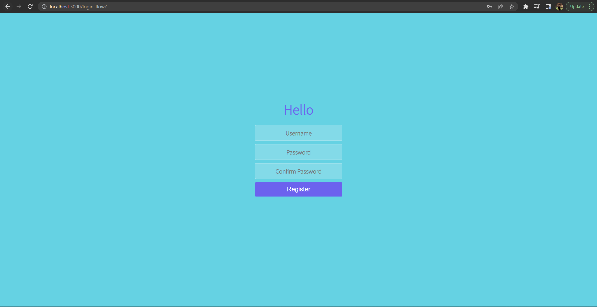
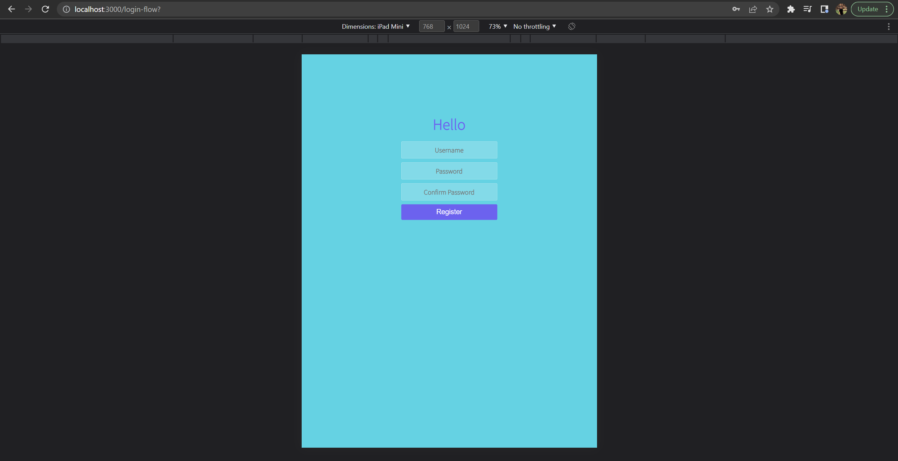
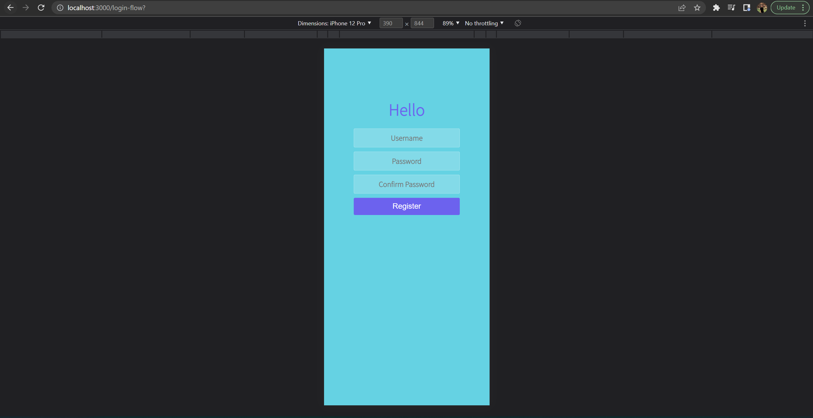
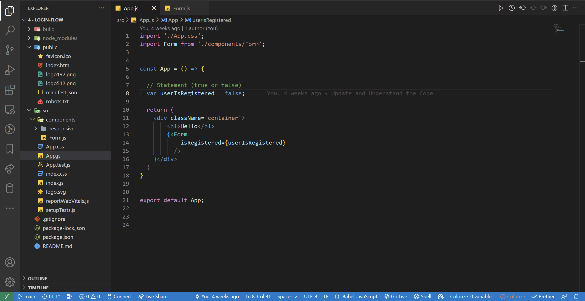

<!-- markdownlint-configure-file {
  "MD013": {
    "code_blocks": false,
    "tables": false
  },
  "MD033": false,
  "MD041": false
} -->

  

# Login Flow Project

This is theLogin Flow Project in Web Development Bootcamp Course 2022.
It is made with React JS.

Web Development Bootcamp 2022 Project - Login Flow

## Website

🖥️ [https://fanciful-paprenjak-aeb3b6.netlify.app/]

✍️ Project by John Cañero

## Responsive Design

🪟: [Desktop - Tablet - Mobile]

